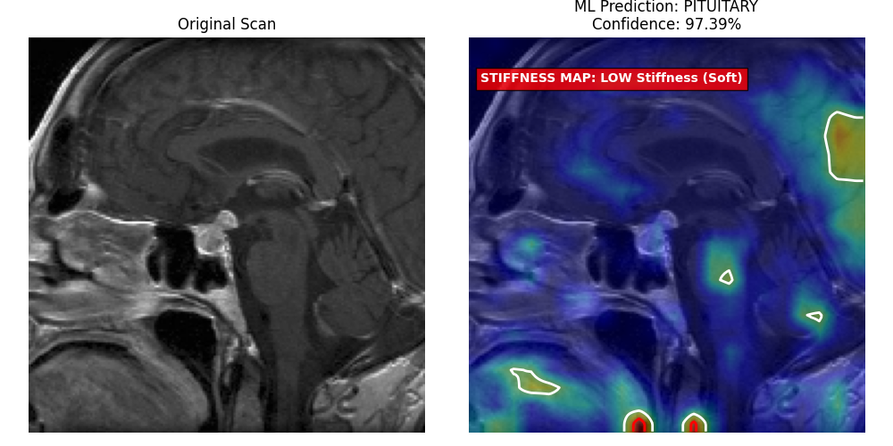

# MRI Tumor Classification & Tissue Stiffness Mapping

## Overview
This project leverages a custom deep Convolutional Neural Network (CNN) and Explainable AI (Grad-CAM) to classify brain tumors from MRI scans and map them to physical tissue stiffness. Designed as a diagnostic and pre-surgical planning tool, it aims to assist automated and robotic surgical systems by predicting the biomechanical properties (Hard, Firm, Soft) of the tumor before intervention.

## Key Features
* **Deep Learning Architecture:** Utilizes a custom 4-block CNN built from scratch using TensorFlow and Keras, optimized with Dropout layers and Data Augmentation to prevent overfitting.
* **Tumor Classification:** Accurately categorizes MRI scans into three primary tumor types: Glioma, Meningioma, and Pituitary Adenoma.
* **Tissue Stiffness Mapping:** Translates the AI's diagnosis into physical biomechanical properties to inform robotic surgical force requirements.
* **Explainable AI (Grad-CAM):** Generates medical heatmaps and contour rings to visually highlight the exact pixels the neural network used to make its diagnosis, ensuring clinical transparency.
* **Clinical Deployment Mode:** Includes an interactive, drop-in folder script that allows medical professionals to test raw, unseen MRI images and instantly generate a side-by-side diagnostic visual.

  

## Project Structure
* `train_1.py`: Initial training script establishing the baseline CNN architecture and data preprocessing pipeline.
* `train_2.py`: Enhanced training script utilizing a structured Train/Test dataset directory, implementing dynamic learning rate reduction (`ReduceLROnPlateau`) and `EarlyStopping`.
* `evaluation_final.py`: The core deployment application. Features an interactive terminal menu with two modes:
  * **Academic Mode:** Generates a Confusion Matrix, ROC Curves, AUC scores, and a Classification Report based on unseen test data.
  * **Clinical Mode:** Scans a custom local directory for new MRI images, processes them, and outputs a visual dashboard containing the original scan, the predicted stiffness, and the Grad-CAM tumor highlight.

## Technology Stack
* **Python 3.x**
* **TensorFlow / Keras:** Deep learning engine and model architecture.
* **Scikit-Learn:** Model evaluation metrics (Confusion Matrix, ROC/AUC).
* **Matplotlib & Seaborn:** Data visualization and clinical dashboard generation.
* **NumPy:** Matrix and tensor mathematical operations.

## Installation & Setup
1. Clone this repository to your local machine:
   ```bash
   git clone [https://github.com/YourUsername/MRI-Tumor-Stiffness-Mapping.git](https://github.com/YourUsername/MRI-Tumor-Stiffness-Mapping.git)
